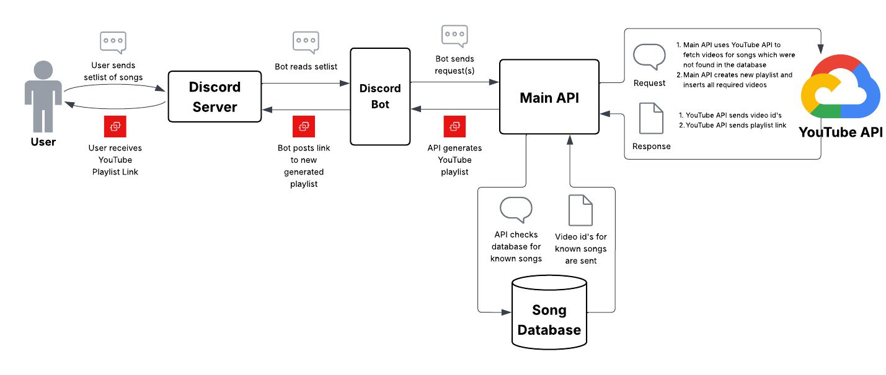

# **Overview**

This project was built to solve a simple, recurring problem: creating a shared YouTube playlist for a band's upcoming setlist is surprisingly tedious. Finding the right version of a song can be challenging, especially for popular tracks that have many renditions on YouTube. When different members prefer different versions of the same song, playlists often stop getting made altogether, leaving the group without a unified reference point. 

This system provides an easier way for teams and bands to generate and maintain YouTube playlists for their performances. It allows users to quickly turn a setlist into a playlist while building a shared repository of songs and preferred videos over time, making future playlist creation faster and more consistent.

The project is intentionally exposed through a Discord bot, since Discord is where many bands already coordinate rehearsals and performances. By embedding the tool directly into an existing workflow, the system reduces friction and makes simplifies the process of playlist creation.

# **Getting Started**
To use the bot for yourself, visit: [Add bot to server](https://discord.com/oauth2/authorize?client_id=1467733213433827439&permissions=2815198591703104&integration_type=0&scope=bot) \
For a guide on the bot's commands, visit: [Bot guide](https://docs.google.com/document/d/10KG11KKhcBYBdYKiKbL_IoNlYHDFSJ2uJuIrS26gFWA/edit?usp=sharing)

# **System Design & Rationale**
The system consists of REST API, a MySQL database, and a Discord bot serving as a pseudo-frontend. Pictured below is a visualization of a user providing the system a setlist of songs and receiving a YouTube playlist containing those songs. 

The following subsections explain key features and design decisions.
## **The API**
The REST API serves as the core of the system and is responsible for managing all persistent resources and business logic. Its routes are intentionally scoped to CRUD-style operations on songs, alternate titles, and playlists, making the API the single source of truth for system state. Clients never interact directly with the database or YouTube credentials; instead, they communicate exclusively with the API, which enforces consistency and isolates side effects.

More complex workflows are handled by a dedicated API wrapper implemented as a client-side abstraction. This wrapper exposes methods that mirror individual API calls, but also composes them into higher-level actions that require multiple requests, such as creating a song with multiple alternate titles and an associated video, or generating a playlist and inserting its videos in sequence. This approach keeps the REST API simple and predictable while allowing richer behavior to be expressed at the client layer without duplicating low-level request logic inside the Discord bot.

Notably, the REST API does not facilitate YouTube video searches. Searching for a video is only required when a user provides a song that does not already exist in the database, and does not correspond to a persistent resource. For this reason, the API wrapper, rather than the REST API itself, performs YouTube video searches and only persists results once a concrete song resource can be created. This design keeps API routes aligned with resource ownership, minimizes unnecessary exposure of search functionality, and reinforces the API’s role as a system of record rather than a general-purpose YouTube proxy.

## **The Database**
The main entity modeled by the database is songs. Each song has exactly one canonical title, and can have multiple or no alternate titles. This design accounts for real-world ambiguities. Songs often go by different names due to different versions and misspellings. By accounting for alternate titles, the system can deduplicate entries while still allowing flexible matching with user input. Each song entity also has a YouTube link attribute, representing a video for that given song.

The database serves two primary purposes. Firstly, it can act as a repository for users. Users can view the database as a historical record of the songs they've performed. Secondly, and most importantly, it quickens the process of generating playlists. In order to insert videos into a playlist through the YouTube Data API, one first needs to have the link to the video (in truth, you need the video's "video ID," but this can be extracted from the link). If we didn't store the links for song resources in the database, then the system would need to make an extra call the YouTube Data API everytime in order to fetch a video for a song specified by the user. By storing links for each song, the database acts somewhat like a cache between the user and the YouTube Data API. Additionally, this design also allows users to assign videos to songs on their own. This allows the system to better match user preferences. Rather than relying on YouTube's search function to find a video matching a song title provided by the user, the system instead allows the user to provide the video they want to associate with the given song.

## **The Discord Bot**
Rather than building a traditional web frontend, this project exposes its functionality through a Discord bot. The bot acts as a client for the REST API, mirroring the routes of the API through user-friendly slash commands. Admittedly, this approach does limit the system's flexibility and expressiveness. A Discord bot is less flashy and a bit harder to work with than a full-fledged website.

Regardless, I opted to make a Discord bot for the following reason. I started this project to solve a problem I saw in my own team, and this team communicates primarily through Discord. Using a Discord bot allowed me to embed the system into an existing workflow, reducing friction and making the system more accessible. It meets users where they already are and offers a simple, minimal interface.
